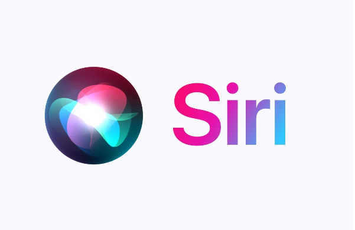

# **General Club Updates**

### Upcoming Event - MAC-A-THON (Jan 31 - Feb 2, 2025)

# Current Tech Updates:

## “Apple working on new AI-powered Siri to take on rivals ChatGPT”

* Apple is working on a new version of Siri, internally named "LLM Siri," featuring advanced conversational capabilities powered by generative AI, as part of its flagship AI initiative, Apple Intelligence.
* Recent job postings reveal Apple's commitment to creating a more conversational Siri, enabling natural back-and-forth conversations and handling complex requests using large language models (LLMs).
* A preview of the revamped Siri is expected in iOS 19 and macOS 16 updates next year, with full functionality available by 2026. Siri will also support direct actions within third-party apps through App Intents.
* Apple developers are testing the AI-enhanced Siri on iPhones, iPads, and Macs via a separate app, with plans to replace the existing Siri interface on Apple devices.
* Introduced nearly 13 years ago, Siri is entering a new phase driven by AI advancements. In June, Apple highlighted AI's role in ushering in a new era for the digital assistant.
* For much more detailed information, visit <https://indianexpress.com/article/technology/artificial-intelligence/apple-new-ai-powered-siri-report-9683108/#:~:text=The%20revamped%20version%20of%20Siri,Siri%20handle%20more%20sophisticated%20requests>.
* If you want to learn more about Meta news, visit <https://www.apple.com/ca/newsroom/>

## "How RTX AI PCs Unlock AI Agents That Solve Complex Problems Autonomously With Generative AI"

### That Thinks Big

Description: Agentic AI is like your personal assistant with superpowers. It doesn’t just answer questions—it strategizes! Whether you need to organize a project, plan an adventure, or juggle tasks, it handles multi-step challenges seamlessly, giving you more time for what truly matters.

### AnythingLLM: Your AI Swiss Army Knife

Description: Meet AnythingLLM, your local AI toolkit that’s all about versatility and security. From summarizing complex reports to automating daily workflows, it’s customizable to suit your needs while keeping your data safe and sound. Think of it as the ultimate productivity booster!

### Powering the Future With NVIDIA RTX

Description: At the heart of these innovations are NVIDIA RTX AI PCs. They bring unmatched speed, precision, and performance, enabling cutting-edge AI applications to run effortlessly. If your imagination is the limit, these GPUs are the engine driving your AI dreams forward.

### Get Involved With the AnythingLLM Community

Description: Dive into a vibrant hub of creators and tech enthusiasts! The AnythingLLM community is a treasure trove of shared prompts, custom commands, and advanced skills that help you innovate faster and smarter. Collaborate, learn, and lead the way in AI development.

Link: https://blogs.nvidia.com/blog/ai-decoded-agents-anythingllm-rtx-ai/

## **“Nvidia Jumps Into AI Music Space With New Audio Generator Fugatto”**

* Nvidia is entering the AI music race by announcing its new artificial intelligence model, Fuggato, for generating music and audio that can change or add voices and generate other novel sounds.
* The company currently does not have immediate plans to release the technology publicly, but they consider Fuggato, short for Foundational Generative Audio Transformer Opus 1, to be a “Swiss Army Knife for sound”.
* The model has the ability to take in and modify existing audio, for instance, by taking a line played on an instrument and then later transforming it into something sung by a human voice with accents and emotions. It also has the ability to take in a recording of someone’s voice and change the accent and tone that it was spoken in.
* Nvidia aims for this technology to be used in the entertainment industry while currently evaluating how to minimize risks if and when they decide to release the model publicly.
* The company is mainly concerned about how this new generative technology can be abused by users in terms of generating misinformation and infringing on copyright laws.
* Link: <https://www.fastcompany.com/91235722/nvidia-ai-model-generates-music-audio-sounds>  <https://www.billboard.com/pro/nvidia-ai-music-space-fugatto-audio-generator/>