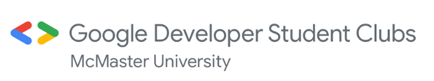
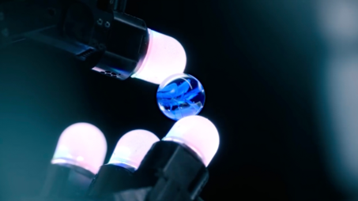
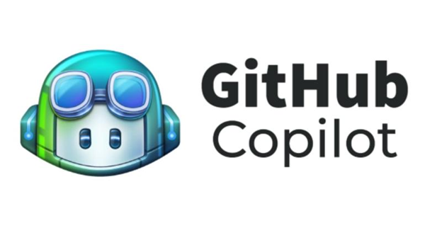
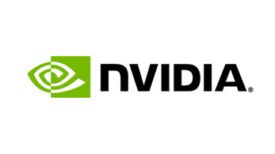

# **General Club Updates**

### Upcoming Event – DevFest 2024 (November 11th, 5:30 PM - 9:30 PM)

Ready to dive into the future of tech? #DevFest2024 is here at McMaster! Connect with fellow developers, explore the latest in tech, and level up your skills through workshops and networking! The location is JHE A101 and all attendees will be provided with a free dinner!! Bubble tea will also be available! [RSVP here](https://gdg.community.dev/events/details/google-gdg-on-campus-mcmaster-university-hamilton-canada-presents-devfest-2024-mcmasteru/) to attend!  

This event is open to all Post-secondary students!

### Upcoming Event - 1P13 Python Review Session (November 28th, 6:45 PM - 8:30 PM)

The Open Source team has already hit the ground running and started working on four exciting projects! We can’t wait for them to showcase their progress, and we’re excited to see what they create. Stay tuned for more updates!

# Current Tech Updates:

## “Meta working on a robotic hand that allows AI models to feel and interact with things”

* Meta recently announced that they are working to deliver **tactile sensors** for AI.
* This AI-powered robotic hand is made to feel and interact with physical objects just as a human would. The goal is to create a hand that can perform delicate tasks with accuracy, such as holding an egg without breaking or adjusting its grip based on feedback from sensors.
* These devices however are not designed for consumers but are instead for scientists so that they can **train AI** to interact with the environment and exist in a safe manner with humans.
  Meta says that it worked with GelSight to make “**Digit360**” and Meta will publicly release the code and design for Digit 360 so that it might help in the development for a more realistic virtual environment.
* GelSight will be in charge of manufacturing and distribution which will be available sometime next year.
* [For much more detailed information on this development, visit here](https://indianexpress.com/article/technology/artificial-intelligence/meta-working-on-a-robotic-hand-that-can-feel-your-touch-9649728/)
* [If you want to learn more about Meta news, visit here](https://about.fb.com/news/)

## GitHub Copilot will support models from Anthropic, Google, and OpenAI

* GitHub is enabling developers to choose **AI models** from Anthropic, Google, and OpenAI in Copilot, enhancing **flexibility** and model selection.
* GitHub introduced Spark, an AI tool for building web apps using **natural language prompts**, offering live previews and the ability for both novices and experienced developers to create and adjust code.
* Enhanced Copilot Features: Updates include **multi-file editing** in VS Code, Copilot Extensions in 2025, a new code review feature, and a public preview of Copilot for Xcode.
* Model Options: GitHub Copilot users will soon be able to select models like Claude 3.5, Gemini 1.5 Pro, and multiple **OpenAI models** (GPT-4o, o1-preview, o1-mini) and switch models during conversations.
* **Spark** aligns with GitHub’s goal to empower a billion developers by **lowering entry barriers and enabling users to create and share apps directly on GitHub**.
* [Learn more about this new feature here](https://openai.com/index/introducing-canvas/)[For much more detailed information, visit here.](https://www.theverge.com/2024/10/29/24282544/github-copilot-multi-model-anthropic-google-open-ai-github-spark-announcement)
* [For more GitHub news, visit here](https://github.blog/)

## Visual Intelligence Unleashed: NVIDIA’s New AI Blueprint Revolutionizes Video Search

* NVIDIA announced a new AI Blueprint for video search and summarization, designed to help developers create AI agents that can analyze and summarize video data at scale
* **What’s an AI Agent?** Think of it as a “digital assistant” trained to watch, interpret, and summarize video footage. In fields like traffic management, security, and retail, these agents help by tracking specific events or details from vast hours of video.
* **The Blueprint:** NVIDIA’s AI Blueprint is a toolkit that guides developers in building these powerful agents. It combines NVIDIA’s advanced Metropolis software with easy, natural language commands, so even non-experts can create agents that understand and respond to custom instructions.
* **Metropolis Integration:** As part of NVIDIA’s Metropolis platform, the Blueprint enables video insights to improve everything from city infrastructure to industrial safety. Developers can deploy these solutions on-site (edge), in the cloud, or through large-scale data centers.
* **Why it Matters:** Video data is everywhere, but it’s challenging to make sense of it all. With this Blueprint, organizations can use video data more efficiently, responding faster to needs or potential problems.
* **See it Live:** NVIDIA will showcase this tech at Smart Cities Expo, demonstrating real-world applications in urban monitoring, security, and public safety.
* [Check out more on the best browser here](https://blogs.nvidia.com/blog/video-search-summarization-ai-agents/)Learn more about this AI blueprint here