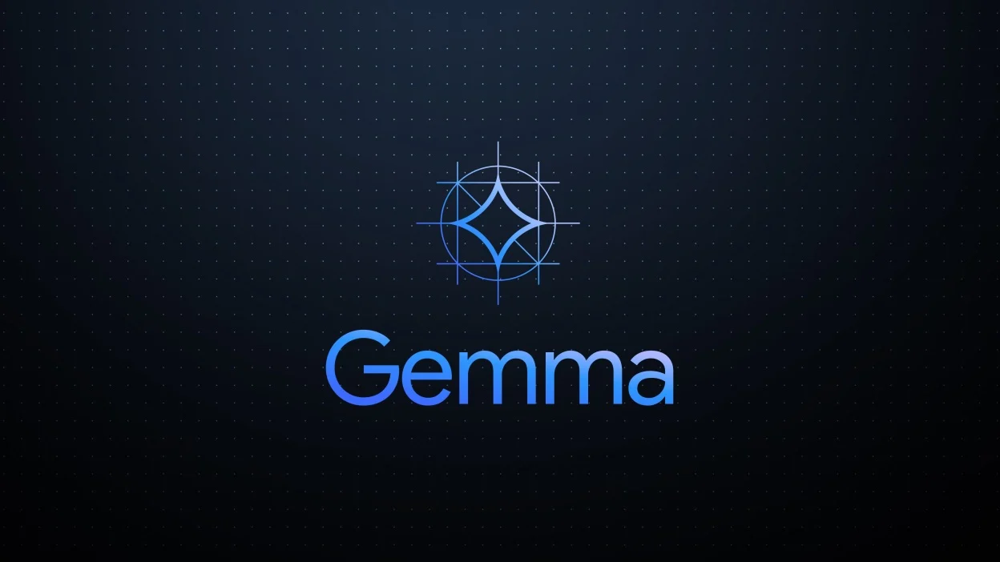
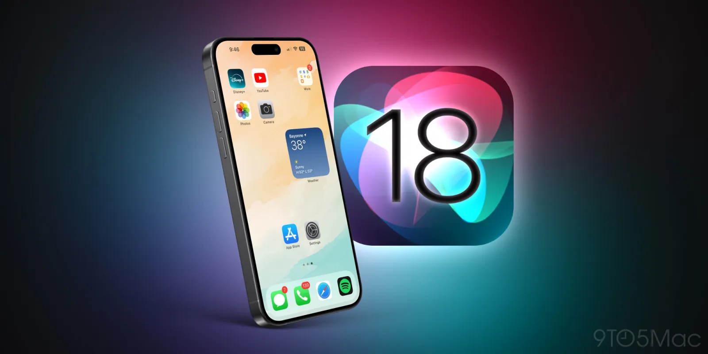

## What & Who We Are?

Welcome to the Google Developer Student Club (GDSC) at McMaster University. We're a dynamic community of tech enthusiasts, innovators, and problem-solvers, dedicated to empowering students with the skills, knowledge, and network needed to thrive in the tech world. Whether you're a coding newbie or a seasoned developer, join us to collaborate on real-world projects and learn from industry experts. Let's build, learn, and grow together :)

The general breakdown of the club is as follows:

- **Admin:** Lead and manage the club, plan high-level events, handle finances, and foster partnerships.
- **Community:** Organize and host tech and community events while collaborating with other organizations.
- **Conferences:** Coordinate participation in major tech events and equip students with the necessary skills and experience.
- **Marketing & Branding:** Manage social media and promote events with engaging graphics.
- **Open Source:** Develop end-to-end applications using industry tech stacks in a collaborative environment.

<!-- *(The detailed description is on the third page, but it depends if we want to keep it, due to space constraints.)* -->

## Featured Events from the Past Year

- **Resume Roasts:** Interactive sessions where participants received personalized feedback on their resumes from industry professionals.
- **OpenCV Workshops:** Practical workshops focused on computer vision techniques and applications using OpenCV.
- **1P10/13 Coding Sessions:** Collaborative coding sessions designed to enhance programming skills and tackle complex problems.
- **Behind the Scenes of ChatGPT Workshop:** An insightful workshop exploring the technology and development behind ChatGPT.

GDSC plans to bring more exciting events this year with innovative workshops, engaging challenges, and collaborative opportunities that push the boundaries of tech and learning.

## Purpose of the Newsletter

GDSC is starting a new initiative where, on the first Tuesday of every month, GDSC will release a monthly newsletter that will include:

- Information about upcoming GDSC events/initiatives.
- Member of the Month feature (starting from October).
- Latest tech stories from the past month.

With the rapid pace of innovation, it's crucial to stay updated on new trends, tools, and developments. The newsletter will serve as a hub for sharing insights, tips, and news on everything from software updates to emerging technologies. It will also help our members stay up-to-date on the latest tech stories and potentially use this information in their academic and professional lives.

## General Current Tech Updates

### Google: 
**Gemma Overview:**  
Gemma is a family of lightweight, open-source AI models developed by Google. These models are designed to be efficient and easy to use for a wide range of applications, such as generating text, understanding images, and answering questions based on visual content. The models in the Gemma family are built using the same research and technology as Google's Gemini models, known for their advanced AI capabilities.

**What's New with Gemma 2:**  
Gemma 2 is the next generation of the Gemma models, bringing significant improvements in performance and efficiency. Key updates include:  
- **Smaller but Powerful:** Gemma 2 can do more with less computational power.
- **Cost-Efficient Deployment:** As Gemma 2 is more efficient, it can be deployed on less expensive hardware, reducing costs for developers.
- **Versatile Tuning:** Developers can easily fine-tune Gemma 2 using a variety of tools and platforms, including Google Cloud and popular community resources like Hugging Face.  
[Visit here for more details](https://developers.googleblog.com/en/)

### Apple:  
**Major Updates in iOS 18:**

- **Advanced AI Integration:** Significant improvements in AI and machine learning features, including enhanced predictive text and advanced photo editing capabilities powered by on-device AI.
- **Upgraded Multitasking Experience:** Multitasking capabilities have been enhanced with more efficient app switching and split-screen options, allowing for a more seamless workflow and improved productivity.  
[More updates found here](https://www.apple.com/ca/ios/ios-18-preview/)

### Microsoft:  
**Microsoft Copilot Updates:**

- **Copilot Integration with Windows 11:** Microsoft has introduced Copilot directly into Windows 11, allowing users to leverage AI for tasks like summarizing documents, generating content, and providing contextual recommendations across various applications.

- **Copilot in Microsoft 365:** Copilot is now embedded within Microsoft 365 apps like Word, Excel, and PowerPoint, helping users automate repetitive tasks, generate drafts, and even analyze data in real-time, significantly enhancing productivity and creativity.  
[More info here](https://blogs.microsoft.com/blog/2024/05/20/introducing-copilot-pcs/)